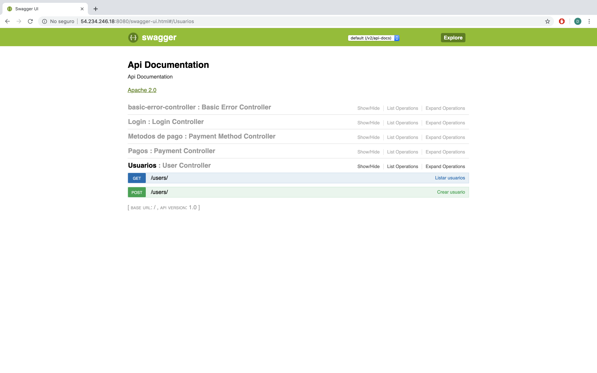
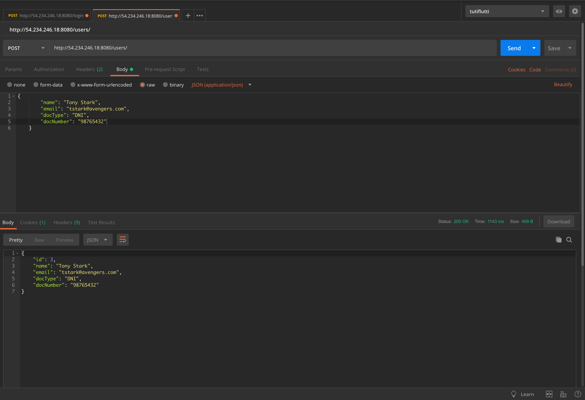

#KAMBISTA PAYMENT

Los objetivos de este proyecto son:

- Crear y Lista Usuarios
- Crear y Lista Métodos de pago
- Hacer un pago

Extra:
- Obtener metodos de pago por usuario
- Listar Pagos
- Obtener usuario por id

###[EJEMPLO EN VIVO](http://54.234.246.18:4000)
Con el fin de dar valor y un agregado visual en este ejemplo se muestra una interfaz que hace uso del API para hacer el flujo completo de un pago.

####Paso 1: Obtener token
Todas los endpoints estan protegidos y es necesario generar un token para hacer uso de ellos.

Por lo tanto el objetivo en este paso no es validar username y password 
sino obtener ese token.

####Paso 2: Usuarios
En este paso se puede crear un nuevo usuario o seleccionar alguno previo

####Paso 3: Métodos de pago
En este paso se puede crear un nuevo método de pago o seleccionar alguno previo

####Paso 4: Pago
En este paso el pago sera ejecutado y guardado.

###API ENDPOINTS
Los endpoints del API pueden ser visualiizados en [SWAGGER](http://54.234.246.18:8080/swagger-ui.html)

###USO DEL API
La URL del API es http://54.234.246.18:8080

Si se intenta consumir los endpoint directamente, este dirá que no tiene acceso.

Para obtener permiso debemos iniciar por el Login

##Login
NOTA: no se validan el username o el password el objetivo es generar un token

Method: POST

Endpooint: /login

Request body: {"username":"cualquiera","passwrod":"cualquiera"}

##Obtener ususarios

Headers: Authorization : token (obtenido en login)

Method: GET

Endpooint: /users/

##Crear usuario

Headers: Authorization : token (obtenido en login)

Method: POST

Endpooint: /users/

Request body: 
{     
"name":"cualquiera",  
"email":"cualquiera@gmail.com",  
"docType":"DNI",  
"email":"87665332"   
}

##Obtener métodos de pago

Headers: Authorization : token (obtenido en login)

Method: GET

Endpooint: /paymentmethods/

##Crear método de pago

Headers: Authorization : token (obtenido en login)

Method: POST

Endpooint: /paymentmethods/

Request body: 
{     
"country":"URUGUAY",  
"currency":"UYU"  
}

##Crear pago

Headers: Authorization : token (obtenido en login)

Method: POST

Endpooint: /payments/

Request body: 
{     
"idUser":"2",  
"idPaymentMethod":"1",  
"totalAmount": 20  
}

###CODIGOS FUENTE
El proyecto esta desplegado en AWS.
Los codigos fuente se encuentra en los siguiente repositorios

[FRONT-END](https://github.com/dmarquina/front-end)

[BACK-END](https://github.com/dmarquina/kambista_payment/tree/master/back-end)

####NOTAS
Con la intención de mantener la documentación simple y por falta de tiempo no se cubren algunas cosas.

El proyecto tiene 3 funcionalidades extras que no se muestran aquí pero pueden ser usadas de la 
misma manera que los demas, pueden ser encontradas en [SWAGGER](http://54.234.246.18:8080/swagger-ui.html)

El proyecto tiene unos cuantos unit test, con mas tiempo pueden ser completadas en su totalidad.